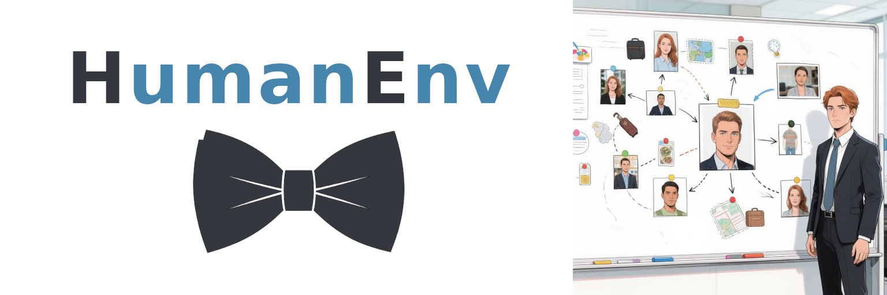

# HumanEnv - приложение для описания социальной сети

Установите зависимости:
- `pip install -r requirements.txt`

Примените миграции:
- `python src/manage.py migrate`

Запустите MediaGarden:
- `python src/gui-qt.py`

## Открытие программы по ссылке в браузере

- https://ru.stackoverflow.com/questions/759297/Как-запустить-мою-программу-при-открытии-ссылки-в-браузере
- https://learn.microsoft.com/ru-ru/windows/apps/develop/launch/launch-default-app
